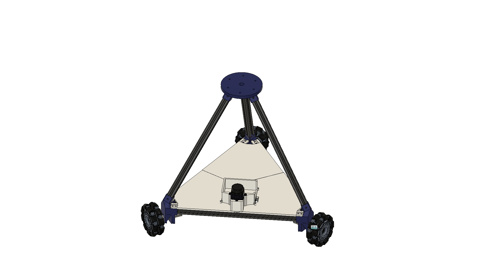

# Kiwi_Drive_Full_Assembly_Copy_Copy — Robot Description



## Overview

| Property | Value |
|----------|-------|
| Total mass | 18.172 kg |
| Links | 5 |
| Joints | 4 (3 movable) |
| Assemblies | 17 |
| Root link | `base_link` |

## Table of Contents

- [Kinematic Tree](#kinematic-tree)
- [Link Properties](#link-properties)
- [Joint Properties](#joint-properties)
- [Assembly Breakdown](#assembly-breakdown)
- [Quick Start (ROS 2)](#quick-start-ros-2)
- [Files](#files)

## Kinematic Tree

```
base_link [BAKE]
  └─ wheel_1_to_base_link [continuous]
    wheel_1_link_Omni_Wheel [BAKE]
  └─ wheel_2_to_base_link [continuous]
    wheel_2_link_Omni_Wheel [BAKE]
  └─ wheel_3_to_base_link [continuous]
    wheel_3_link_Omni_Wheel [BAKE]
  └─ base_link_to_lidar_link [fixed]
    Lidar_Mounting_Plate
```

## Link Properties

| Link | Mass (kg) | Material | Collision | Bodies |
|------|-----------|----------|-----------|--------|
| `Lidar_Mounting_Plate` | 1.0862 | Steel | box | 1 |
| `base_link` | 11.6921 | Steel | box | 1 |
| `wheel_1_link_Omni_Wheel` | 1.7978 | Steel | box | 60 |
| `wheel_2_link_Omni_Wheel` | 1.7978 | Steel | box | 60 |
| `wheel_3_link_Omni_Wheel` | 1.7978 | Steel | box | 60 |

## Joint Properties

| Joint | Type | Parent → Child | Axis | Limits |
|-------|------|---------------|------|--------|
| `base_link_to_lidar_link` | fixed | `base_link` → `Lidar_Mounting_Plate` | (0,0,1) | — |
| `wheel_1_to_base_link` | continuous | `base_link` → `wheel_1_link_Omni_Wheel` | (0,0,1) | — |
| `wheel_2_to_base_link` | continuous | `base_link` → `wheel_2_link_Omni_Wheel` | (0,0,1) | — |
| `wheel_3_to_base_link` | continuous | `base_link` → `wheel_3_link_Omni_Wheel` | (0,0,1) | — |

## Assembly Breakdown

### A1_ASM

- **Links**: 
- **Total mass**: 0.000 kg

### Battery_Mount_Assembly

- **Links**: 
- **Total mass**: 0.000 kg

### Converter_DCDC_RECOM_R_78E_0_5_THT

- **Links**: 
- **Total mass**: 0.000 kg

### LD19_LiDAR

- **Links**: 
- **Total mass**: 0.000 kg

### Main_PCB

- **Links**: 
- **Total mass**: 0.000 kg

### OmniWheelwithHub

- **Links**: 
- **Total mass**: 0.000 kg

### Omni_Wheel

- **Links**: 
- **Total mass**: 0.000 kg

### PCB_Housing

- **Links**: 
- **Total mass**: 0.000 kg

### PinHeader_1x02_P2_54mm_Vertical

- **Links**: 
- **Total mass**: 0.000 kg

### PinHeader_1x04_P2_54mm_Vertical

- **Links**: 
- **Total mass**: 0.000 kg

### PinHeader_1x10_P2_54mm_Vertical

- **Links**: 
- **Total mass**: 0.000 kg

### Wheel_Hub

- **Links**: 
- **Total mass**: 0.000 kg

### base_link

- **Links**: base_link
- **Total mass**: 11.692 kg

### lidar_link

- **Links**: Lidar_Mounting_Plate
- **Total mass**: 1.086 kg

### wheel_1_link

- **Links**: wheel_1_link_Omni_Wheel
- **Total mass**: 1.798 kg

### wheel_2_link

- **Links**: wheel_2_link_Omni_Wheel
- **Total mass**: 1.798 kg

### wheel_3_link

- **Links**: wheel_3_link_Omni_Wheel
- **Total mass**: 1.798 kg

## Quick Start (ROS 2)

```bash
# 1. Copy package to your ROS 2 workspace
cp -r Kiwi_Drive_Full_Assembly_Copy_Copy_description ~/ros2_ws/src/

# 2. Build
cd ~/ros2_ws
colcon build --packages-select Kiwi_Drive_Full_Assembly_Copy_Copy_description
source install/setup.bash

# 3. Visualize in RViz2
ros2 launch Kiwi_Drive_Full_Assembly_Copy_Copy_description display.launch.py

# 4. Validate URDF structure
check_urdf install/Kiwi_Drive_Full_Assembly_Copy_Copy_description/share/Kiwi_Drive_Full_Assembly_Copy_Copy_description/urdf/Kiwi_Drive_Full_Assembly_Copy_Copy.urdf

# 5. Print kinematic tree
urdf_to_graphviz install/Kiwi_Drive_Full_Assembly_Copy_Copy_description/share/Kiwi_Drive_Full_Assembly_Copy_Copy_description/urdf/Kiwi_Drive_Full_Assembly_Copy_Copy.urdf
```

**Joint control**: The launch file includes `joint_state_publisher_gui` —
use the sliders to move revolute/prismatic joints in RViz2.

**Topic inspection**:
```bash
# See published joint states
ros2 topic echo /joint_states

# See robot description parameter
ros2 param get /robot_state_publisher robot_description
```

## Files

| Path | Description |
|------|-------------|
| `urdf/Kiwi_Drive_Full_Assembly_Copy_Copy.urdf.xacro` | Top-level xacro (entry point) |
| `urdf/Kiwi_Drive_Full_Assembly_Copy_Copy.urdf` | Flat URDF (for validation) |
| `urdf/assemblies/` | Per-assembly xacro macros |
| `meshes/` | Visual (OBJ) and collision (STL) meshes |
| `launch/display.launch.py` | Launch robot_state_publisher, RViz, and generated controllers |
| `config/joint_state.yaml` | Joint state publisher config |
| `config/ros2_controllers.yaml` | Generated ros2_control controller manager config |
| `robot_data.yaml` | Supplementary data (beyond URDF) |
| `docs/transforms.md` | Transformation matrices (KaTeX) |

## Customizing

Assemblies tagged `!dummy_` are designed to be swapped out. To replace one:

1. Create your replacement as a xacro macro with the same interface
2. Place it in `urdf/assemblies/`
3. Update the `<xacro:include>` in `urdf/Kiwi_Drive_Full_Assembly_Copy_Copy.urdf.xacro`
4. Update meshes in `meshes/<your_assembly>/`

The xacro prefix system (`${prefix}`) ensures link names stay unique
when multiple instances of the same assembly are used.

---
*Generated by Fusion URDF/XACRO Exporter v3.1.0*